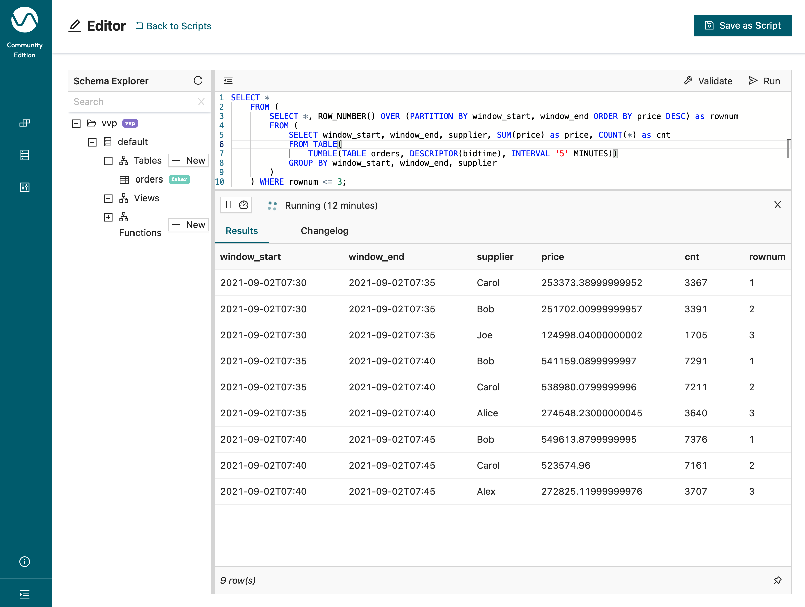

# 11 Window Top-N


> :bulb: This example will show how to calculate the Top 3 suppliers who have the highest sales for every tumbling 5 minutes window.

The source table (`orders`) is backed by the [`faker` connector](https://flink-packages.org/packages/flink-faker), which continuously generates rows in memory based on Java Faker expressions.

In our previous recipes we've shown how you can [aggregate time series data](../01_group_by_window/01_group_by_window_tvf.md) using the `TUMBLE` function and also how you can get continuous [Top-N results](../05_top_n/05_top_n.md).
In this recipe, you will use the `Window Top-N` [feature](https://ci.apache.org/projects/flink/flink-docs-stable/docs/dev/table/sql/queries/window-topn/) to display the top 3 suppliers with the highest sales every 5 minutes. 

The difference between the regular Top-N and this Window Top-N, is that Window Top-N only emits final results, which is the total top N records at the end of the window. 

```sql
CREATE TABLE orders ( 
    bidtime TIMESTAMP(3),
    price DOUBLE, 
    item STRING,
    supplier STRING,
    WATERMARK FOR bidtime AS bidtime - INTERVAL '5' SECONDS
) WITH (
  'connector' = 'faker',
  'fields.bidtime.expression' = '#{date.past ''30'',''SECONDS''}',
  'fields.price.expression' = '#{Number.randomDouble ''2'',''1'',''150''}',
  'fields.item.expression' = '#{Commerce.productName}',
  'fields.supplier.expression' = '#{regexify ''(Alice|Bob|Carol|Alex|Joe|James|Jane|Jack)''}',
  'rows-per-second' = '100'
);

SELECT *
    FROM (
        SELECT *, ROW_NUMBER() OVER (PARTITION BY window_start, window_end ORDER BY price DESC) as rownum
        FROM (
            SELECT window_start, window_end, supplier, SUM(price) as price, COUNT(*) as cnt
            FROM TABLE(
                TUMBLE(TABLE orders, DESCRIPTOR(bidtime), INTERVAL '10' MINUTES))
            GROUP BY window_start, window_end, supplier
        )
    ) WHERE rownum <= 3;
```

## Example Output


