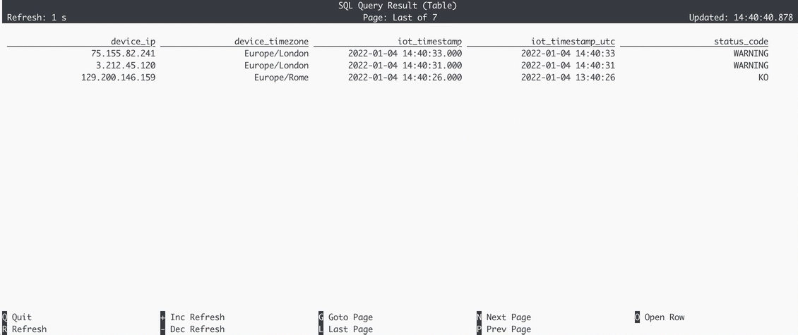

# 09 Convert timestamps with timezones


> :bulb: In this recipe, you will learn how to consolidate timestamps with different time zones to UTC. 

Timestamps in incoming data can refer to different time zones and consolidating them to the same time zone (e.g. UTC) is a prerequisite to ensure correctness in temporal analysis.

The source table (`iot_status`) is backed by the [`faker` connector](https://flink-packages.org/packages/flink-faker), which continuously generates fake IoT status messages in memory based on Java Faker expressions.

In this recipe we create a table which contains IoT devices status updates including timestamp and device time zone, which we'll convert to UTC. 

We create the table first, then use a select statement including the [CONVERT_TZ](https://nightlies.apache.org/flink/flink-docs-stable/docs/dev/table/functions/systemfunctions/#temporal-functions) function to convert the timestamp to UTC.

```sql
CREATE TABLE iot_status ( 
    device_ip       STRING,
    device_timezone STRING,
    iot_timestamp   TIMESTAMP(3),
    status_code     STRING, 
    WATERMARK FOR iot_timestamp AS iot_timestamp - INTERVAL '30' SECONDS
) WITH (
  'connector' = 'faker', 
  'fields.device_ip.expression' = '#{Internet.publicIpV4Address}',
  'fields.device_timezone.expression' =  '#{regexify ''(America\/Los_Angeles|Europe\/Rome|Europe\/London|Australia\/Sydney){1}''}',
  'fields.iot_timestamp.expression' =  '#{date.past ''15'',''5'',''SECONDS''}',
  'fields.status_code.expression' = '#{regexify ''(OK|KO|WARNING){1}''}',
  'rows-per-second' = '3'
);

SELECT 
  device_ip, 
  device_timezone,
  iot_timestamp,
  convert_tz(cast(iot_timestamp as string), device_timezone, 'UTC') iot_timestamp_utc,
  status_code
FROM iot_status;
```

## Example Output


