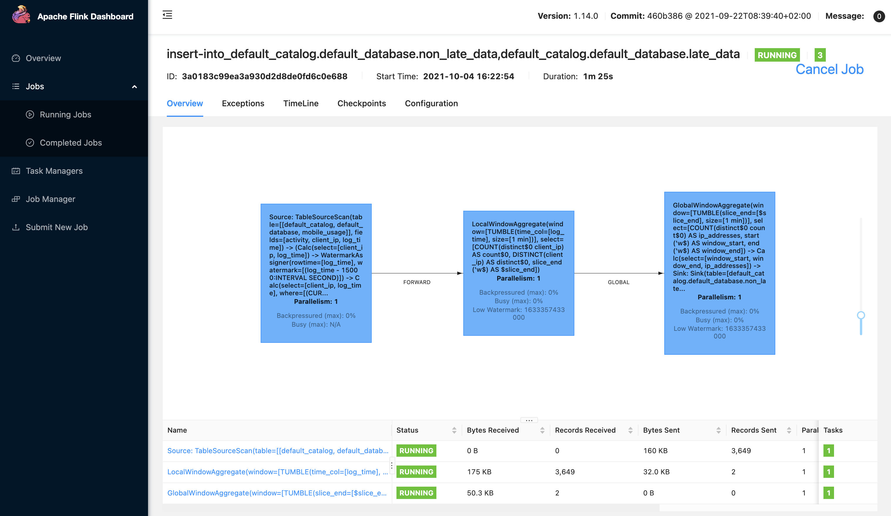
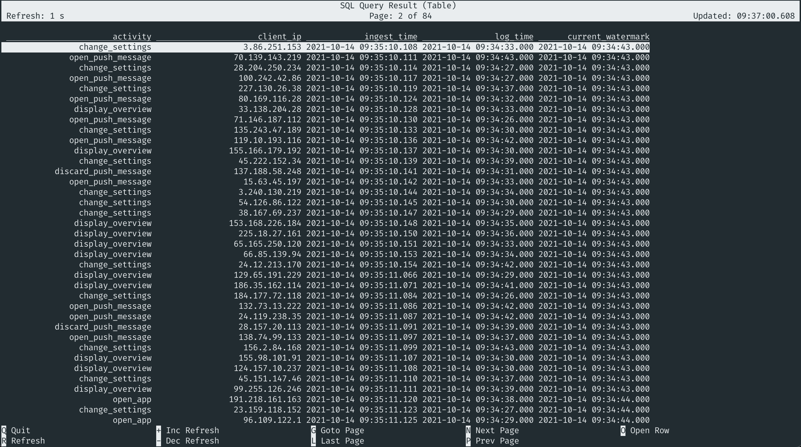

# 03 Filtering out Late Data


> :bulb: This example will show how to filter out late data using the `CURRENT_WATERMARK` function.

The source table (`mobile_usage`) is backed by the [`faker` connector](https://flink-packages.org/packages/flink-faker), which continuously generates rows in memory based on Java Faker expressions.

As explained before in the [watermarks recipe](../../aggregations-and-analytics/02_watermarks/02_watermarks.md), Flink uses watermarks to measure progress in event time. By using a `WATERMARK` attribute in a table's DDL, we signify a column as the table's event time attribute and tell Flink how out of order we expect our data to arrive.  

There are many cases when rows are arriving even more out of order than anticipated, i.e. after the watermark. This data is called *late*.  An example could be when someone is using a mobile app while being offline because of lack of mobile coverage or flight mode being enabled. When Internet access is restored, previously tracked activities would then be sent.

In this recipe, we'll filter out this late data using the [`CURRENT_WATERMARK`](https://ci.apache.org/projects/flink/flink-docs-release-1.14/docs/dev/table/functions/systemfunctions/) function. In the first statement, we'll use the non-late data combined with the [`TUMBLE`](../../aggregations-and-analytics/01_group_by_window/01_group_by_window_tvf.md) function to send the unique IP addresses per minute to a downstream consumer (like a BI tool). Next to this use case, we're sending the late data to a different sink. For example, you might want to use these rows to change the results of your product recommender for offline mobile app users. 

This table DDL contains both an event time and a processing time definition. `ingest_time` is defined as processing time, while `log_time` is defined as event time and will contain timestamps between 45 and 10 seconds ago.   

## Script

```sql
-- Create source table
CREATE TABLE `mobile_usage` ( 
    `activity` STRING, 
    `client_ip` STRING,
    `ingest_time` AS PROCTIME(),
    `log_time` TIMESTAMP_LTZ(3), 
    WATERMARK FOR log_time AS log_time - INTERVAL '15' SECONDS
) WITH (
  'connector' = 'faker', 
  'rows-per-second' = '50',
  'fields.activity.expression' = '#{regexify ''(open_push_message|discard_push_message|open_app|display_overview|change_settings)''}',
  'fields.client_ip.expression' = '#{Internet.publicIpV4Address}',
  'fields.log_time.expression' =  '#{date.past ''45'',''10'',''SECONDS''}'
);

-- Create sink table for rows that are non-late
CREATE TABLE `unique_users_per_window` ( 
    `window_start` TIMESTAMP(3), 
    `window_end` TIMESTAMP(3),
    `ip_addresses` BIGINT
) WITH (
  'connector' = 'blackhole'
);

-- Create sink table for rows that are late
CREATE TABLE `late_usage_events` ( 
    `activity` STRING, 
    `client_ip` STRING,
    `ingest_time` TIMESTAMP_LTZ(3),
    `log_time` TIMESTAMP_LTZ(3), 
    `current_watermark` TIMESTAMP_LTZ(3)    
) WITH (
  'connector' = 'blackhole'
);

-- Create a view with non-late data
CREATE TEMPORARY VIEW `mobile_data` AS
    SELECT * FROM mobile_usage
    WHERE CURRENT_WATERMARK(log_time) IS NULL
          OR log_time > CURRENT_WATERMARK(log_time);

-- Create a view with late data
CREATE TEMPORARY VIEW `late_mobile_data` AS 
    SELECT * FROM mobile_usage
        WHERE CURRENT_WATERMARK(log_time) IS NOT NULL
              AND log_time <= CURRENT_WATERMARK(log_time);

BEGIN STATEMENT SET;

-- Send all rows that are non-late to the sink for data that's on time
INSERT INTO `unique_users_per_window`
    SELECT `window_start`, `window_end`, COUNT(DISTINCT client_ip) AS `ip_addresses`
      FROM TABLE(
        TUMBLE(TABLE mobile_data, DESCRIPTOR(log_time), INTERVAL '1' MINUTE))
      GROUP BY window_start, window_end;

-- Send all rows that are late to the sink for late data
INSERT INTO `late_usage_events`
    SELECT *, CURRENT_WATERMARK(log_time) as `current_watermark` from `late_mobile_data`;
      
END;
```

## Example Output



### Late data


