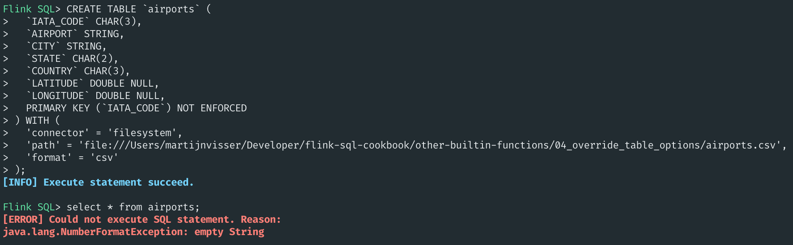
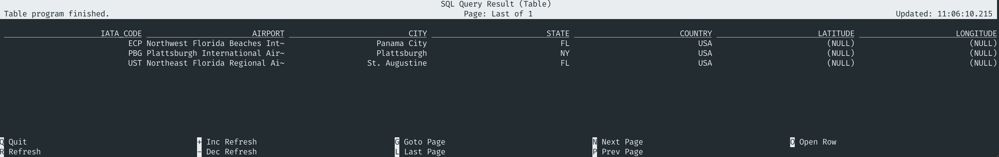

# 04 Overriding table options


> :bulb: This example will show how you can override table options that have been defined via a DDL by using Hints.

This recipe uses the `2015 Flight Delays and Cancellations` dataset which can be found on [Kaggle](https://www.kaggle.com/usdot/flight-delays).

As explained before in the [creating tables recipe](../../foundations/01_create_table/01_create_table.md), you create tables in Flink SQL by using a SQL DDL. For example, you would use the following DDL to create a table `airports` which reads available airports in via the provided CSV file. 

> :warning: Make sure that the value for `path` is correct for your location environment.

```sql
CREATE TABLE `airports` (
  `IATA_CODE` CHAR(3),
  `AIRPORT` STRING,
  `CITY` STRING,
  `STATE` CHAR(2),
  `COUNTRY` CHAR(3),
  `LATITUDE` DOUBLE NULL,
  `LONGITUDE` DOUBLE NULL,
  PRIMARY KEY (`IATA_CODE`) NOT ENFORCED
) WITH (
  'connector' = 'filesystem',
  'path' = 'file:///flink-sql-cookbook/other-builtin-functions/04_override_table_options/airports.csv',
  'format' = 'csv'
);
```

After creating this table, you would normally query it using something like:

```sql
SELECT * FROM `airports`;
```

However, this currently doesn't work because there is an improperly formatted line in the CSV file. There is an option for CSV files to ignore parsing errors, but that means you need to alter the table. 

You can also override the defined table options using [SQL Hints](https://nightlies.apache.org/flink/flink-docs-stable/docs/dev/table/sql/queries/hints/). Your SQL statement would then look like:

```sql
SELECT * FROM `airports` /*+ OPTIONS('csv.ignore-parse-errors'='true') */;
```

Since the CSV format option `csv.ignore-parse-errors` sets fields to null in case of errors, you can also quickly identify which fields can't be parsed using:

```sql
SELECT * FROM `airports` /*+ OPTIONS('csv.ignore-parse-errors'='true') */ WHERE `LATITUDE` IS NULL;
```

You can apply SQL Hints for all possible table options. For example, if you SQL job which reads from Kafka has crashed, you can override the default reading position:

```sql
SELECT * FROM `your_kafka_topic` /*+ OPTIONS('scan.startup.mode'='group-offsets') */;
```

Tables, views and functions are all registered in the catalog. The catalog is a collection of metadata. Using SQL Hints, you can override any defined metadata.  

## Example Output


