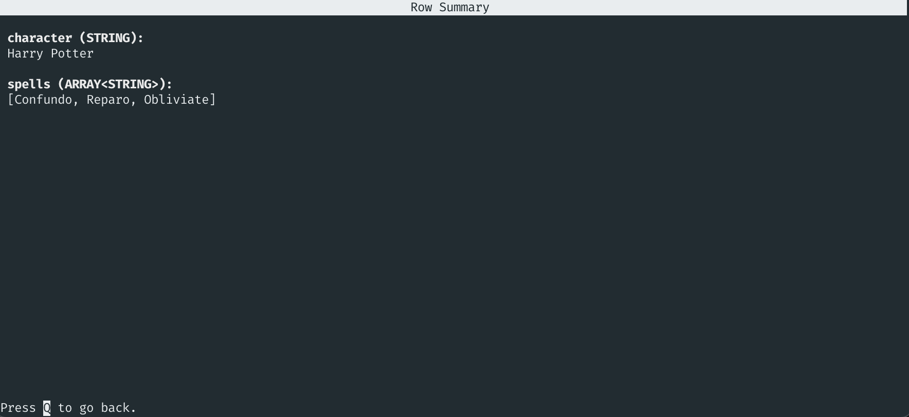
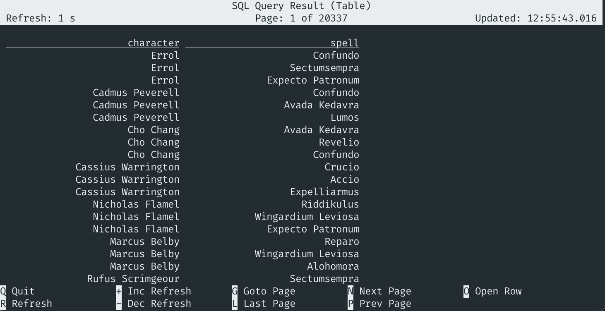
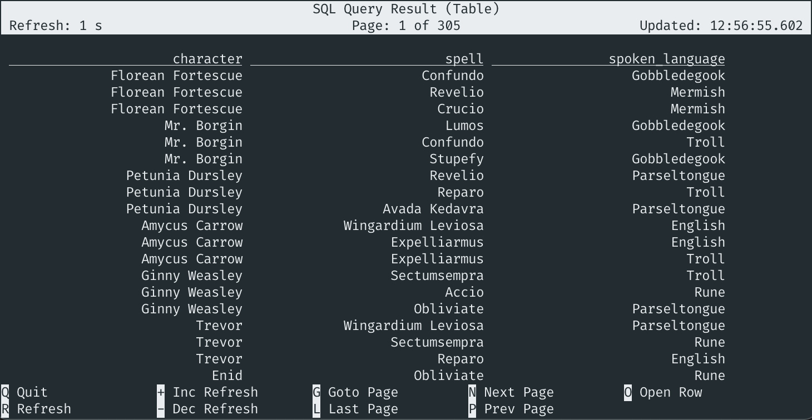

# 05 Expanding arrays into new rows


> :bulb: This example will show how to create new rows for each element in an array using a `CROSS JOIN UNNEST`.

The source table (`HarryPotter`) is backed by the [`faker` connector](https://flink-packages.org/packages/flink-faker), which continuously generates rows in memory based on Java Faker expressions.

There are many cases where data contains complex data types. Complex data types means that the data is structured in a nested way. Examples of these data types are `ARRAY`, `MAP` or `ROW`.

In this recipe, we'll expand an `ARRAY` into a new row for each element using `CROSS JOIN UNNEST` and join the new rows with a lookup table.

This table DDL creates a `HarryPotter` themed table. It contains a character from Harry Potter and 3 spells that the character used. The `spells` is of data type `ARRAY`.

## Script

```sql
-- Create source table
CREATE TABLE `HarryPotter` (
  `character` STRING,
  `spells` ARRAY<STRING>
) WITH (
  'connector' = 'faker',
  'fields.character.expression' = '#{harry_potter.character}',
  'fields.spells.expression' = '#{harry_potter.spell}',
  'fields.spells.length' = '3'
);
```

When querying this table, your results will look like this:



In order to generate new rows for each element in the `spells` array, we’ll use a `CROSS JOIN UNNEST`. By applying this statement, the `UNNEST` will create one row for each element in `spells`, which we will store in a temporary table `SpellsTable`. Secondly, the `CROSS JOIN` joins each row in the `SpellsTable` with the matching row  of the `HarryPotter` table. The DDL below will create a view that we’ll use to join all the newly generated rows with a lookup table.

```sql
CREATE TEMPORARY VIEW `SpellsPerCharacter` AS
  SELECT `HarryPotter`.`character`, `SpellsTable`.`spell`
  FROM HarryPotter 
  CROSS JOIN UNNEST(HarryPotter.spells) AS SpellsTable (spell);
```

The results of this view will contain each individual spell as a row. The results look like the following:



You can then use the resulting table like you normally would, for example, for joining with a lookup table. Here, we enrich each `spell` with the `spoken_language` so that you can see in which language the spells were cast.

```sql
CREATE TABLE `Spells_Language` (
  `spells` STRING,
  `spoken_language` STRING, 
  `proctime` AS PROCTIME()
)
WITH (
  'connector' = 'faker', 
  'fields.spells.expression' = '#{harry_potter.spell}',
  'fields.spoken_language.expression' = '#{regexify ''(Parseltongue|Rune|Gobbledegook|Mermish|Troll|English)''}'
);
```

```sql
SELECT 
  `SpellsPerCharacter`.`character`, 
  `SpellsPerCharacter`.`spell`, 
  `Spells_Language`.`spoken_language`
FROM SpellsPerCharacter
JOIN Spells_Language FOR SYSTEM_TIME AS OF proctime AS Spells_Language
ON SpellsPerCharacter.spell = Spells_Language.spells;
```

## Example Output

