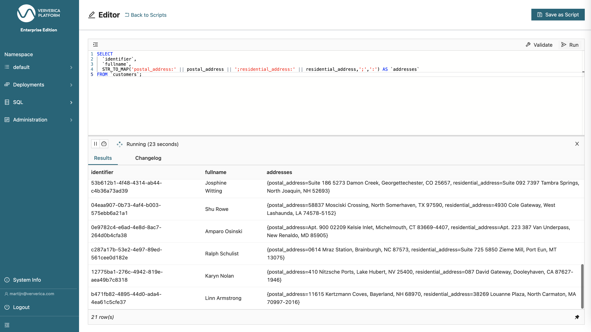

# 06 Split strings into maps


> :bulb: This example will show how you can create a map of key/value pairs by splitting string values using `STR_TO_MAP`.

The source table (`customers`) is backed by the [`faker` connector](https://flink-packages.org/packages/flink-faker), which continuously generates rows in memory based on Java Faker expressions.

There are many different data types in Flink SQL. You can group these in Character Strings, Binary Strings, Exact Numerics, Approximate Numerics, Date and Time, Constructed Data Types, User-Defined Types and Other Data Types.
Some examples are `VARCHAR/STRING`, `CHAR`, `DECIMAL`, `DATE`, `TIME`, `TIMESTAMP`, `ARRAY`, `MAP`, `ROW` and `JSON`. You can find more information about these data types in the [Flink SQL Data Types Reference](https://nightlies.apache.org/flink/flink-docs-master/docs/dev/table/types/). 

In this recipe, we'll convert two `STRING` columns containing a `postal_address` and a `residential_address` into a `MAP` column. 

This table DDL creates a `customers` table. It contains an identifier, the full name of a customer, the address to which you sent mail and the address where the customer is living.

## Script

```sql
-- Create source table
CREATE TABLE `customers` (
  `identifier` STRING,
  `fullname` STRING,
  `postal_address` STRING,
  `residential_address` STRING
) WITH (
  'connector' = 'faker',
  'fields.identifier.expression' = '#{Internet.uuid}',
  'fields.fullname.expression' = '#{Name.firstName} #{Name.lastName}',
  'fields.postal_address.expression' = '#{Address.fullAddress}',
  'fields.residential_address.expression' = '#{Address.fullAddress}',
  'rows-per-second' = '1'
);
```

After creating this table, we use the [`STR_TO_MAP`](https://nightlies.apache.org/flink/flink-docs-stable/docs/dev/table/functions/systemfunctions/#string-functions) in our SELECT statement.
This function splits a `STRING` value into one or more key/value pair(s) using a delimiter. 
The default pair delimiter is `,` but this can be adjusted by providing a second argument to this function. In this example, we change the pair delimiter to `;` since our addresses can contain `,`.
There is also a default key-value delimiter, which is `=`. In this example, we're changing this to `:` by providing a third argument to the function. 

To create our `MAP` column, we're using `||` to concatenate multiple `STRING` values. 
We're hardcoding the first key to 'postal_address:' to include the key-value delimiter and concatenate the value from the `postal_address` column.
We then continue with hardcoding our second key to ';residential_address:'. That includes the pair delimiter `;` as a prefix and again `:` as our key-value delimiter as a suffix. 
To complete the function, we change the default values for pair delimiter and key-value delimiter to `;` and `:` respectively.

```sql
SELECT 
  `identifier`,
  `fullname`,
  STR_TO_MAP('postal_address:' || postal_address || ';residential_address:' || residential_address,';',':') AS `addresses`
FROM `customers`;
```

## Example Output

