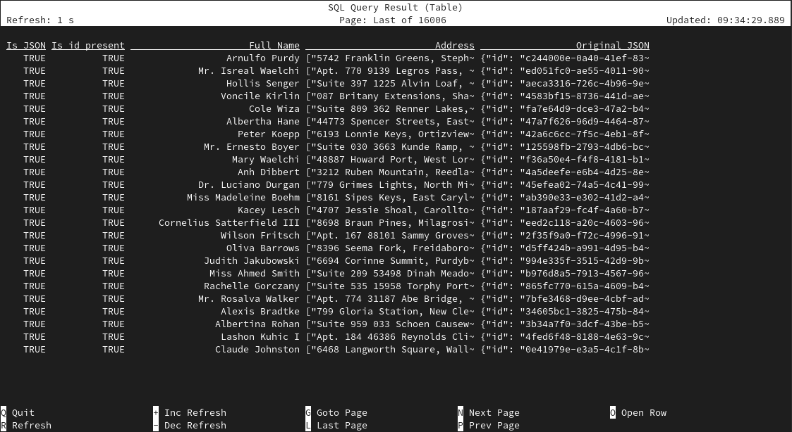

# 07 Extract data from JSON


> :bulb: This example will show how you can extract data from JSON using JSON functions.

The source table (`clients`) is backed by the [`faker` connector](https://flink-packages.org/packages/flink-faker), which continuously generates JSON strings in memory based on datafaker expressions.

There are many JSON functions in FlinkSQL. Within this receipt we are going to touch some of them: `IS JSON`, `JSON_EXISTS`, `JSON_VALUE`, `JSON_QUERY`. You can find more information about these and other JSON functions in the [Flink SQL JSON Functions](https://nightlies.apache.org/flink/flink-docs-master/docs/dev/table/functions/systemfunctions/#json-functions).

In this recipe, we'll check whether data in string is a `JSON`, extract some scalar and more complex values from `JSON`.

This table DDL creates a `clients` table. It contains a json with identifier, a full name of a client and an array of addresses (2 elements) to which a company could send mail.

## Script

```sql
 CREATE TEMPORARY TABLE clients (
   `json_string` STRING
 )
 WITH (
   'connector' = 'faker',
   'fields.json.expression' = '#{jsona ''-1'',''id'',''#{Internet.uuid}'',''-1'', ''full_name'',''#{Name.full_name}'',''2'',''addresses'',''#{json ''''address'''',''''#{Address.fullAddress}''''}''}'
 );
```

After creating the table we are going to use json functions. First let's consider `IS JSON` which could tell if a string is a json or not. The next one is `JSON_EXISTS` which determines whether a json satisfies search path criteria. Here, the special character `$` denotes the root node in a JSON path.
`JSON_VALUE`: Extracts a scalar from a JSON string. `JSON_QUERY`: Extracts JSON values from a JSON string.

```sql
 SELECT 
  json_string IS JSON as `Is JSON`, 
  JSON_EXISTS(json_string, '$.id') as `Is id present`,
  JSON_VALUE(json_string, '$.full_name') as `Full Name`,
  JSON_QUERY(json_string, '$.addresses[*].address') as `Address`,
  json_string as `Original JSON`
 FROM clients;
```

## Example Output

