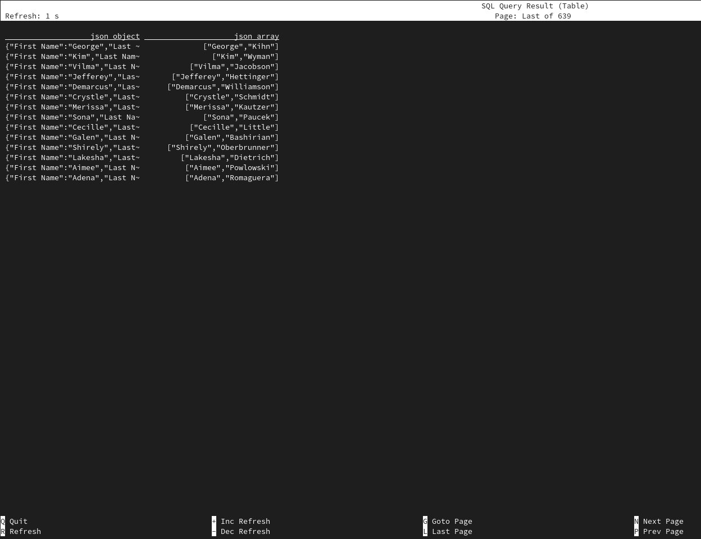
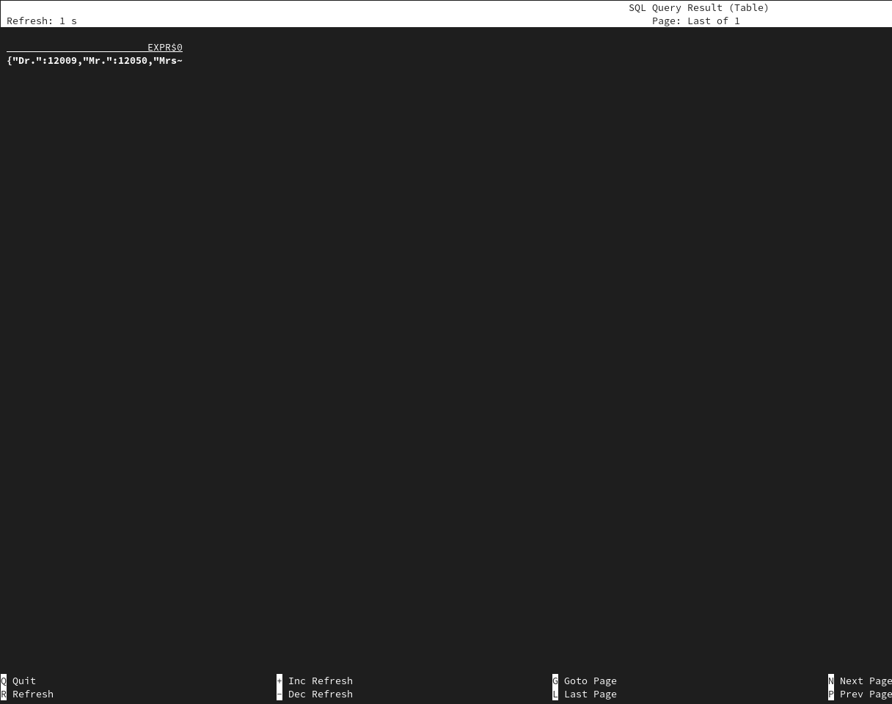
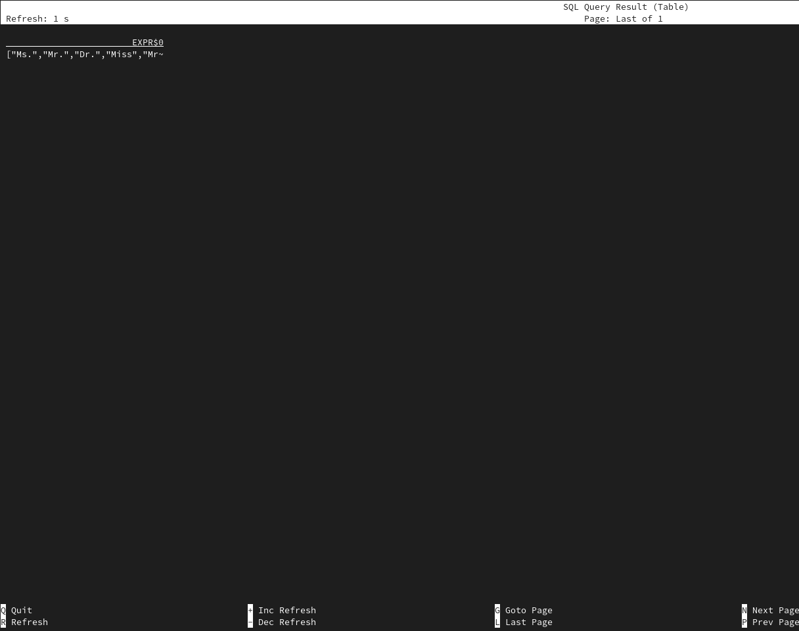

# 08 Generate JSON from data


> :bulb: This example will show how you can generate JSON using JSON functions.

The source table (`clients`) is backed by the [`faker` connector](https://flink-packages.org/packages/flink-faker), which continuously generates rows in memory based on Data Faker expressions.

There are many JSON functions in FlinkSQL. Within this recipe we are going to touch some of them: `JSON_ARRAY`, `JSON_OBJECT`, `JSON_OBJECTAGG`. You can find more information about these and other JSON functions in the [Flink SQL JSON Functions](https://nightlies.apache.org/flink/flink-docs-master/docs/dev/table/functions/systemfunctions/#json-functions).

This table DDL creates a `clients` table. It contains names of a client and an array of addresses (2 elements) to which a company could send mail.

## Script

```sql
CREATE TEMPORARY TABLE clients (
  `prefix` STRING,
  `first_name` STRING,
  `last_name` STRING,
  `address` ARRAY<STRING>
)
WITH (
  'connector' = 'faker',
  'fields.first_name.expression' = '#{Name.first_name}',
  'fields.last_name.expression' = '#{Name.last_name}',
  'fields.address.expression' = '#{Address.full_address}',
  'fields.address.length' = '3',
  'fields.prefix.expression' = '#{Name.prefix}'
);
```

After creating the table we are going to use json functions.
`JSON_OBJECT` allows to create an object by specifying keys and values
`JSON_ARRAY` creates a JSON array.

```sql
SELECT 
 JSON_OBJECT(KEY 'First Name' VALUE first_name, KEY 'Last Name' VALUE last_name, KEY 'address' VALUE address) AS `json_object`, 
 JSON_ARRAY(first_name, last_name) AS `json_array` 
FROM clients;
```


Furthermore, there are aggregating JSON functions 
`JSON_OBJECTAGG` builds JSON object aggregating key-value into JSON object.
The query will count prefixes and build json object for those which are appeared more than once.
```sql
SELECT JSON_OBJECTAGG(KEY prefix VALUE cnt)
  FROM (SELECT prefix, COUNT(1) cnt FROM clients GROUP BY prefix) t WHERE cnt > 1;
```

and
`JSON_ARRAYAGG` builds JSON array aggregating items into array.
The query will construct a JSON array of distinct prefixes.
```sql
SELECT JSON_ARRAYAGG(prefix)
  FROM (SELECT DISTINCT prefix FROM clients) t;
```

## Example Output


