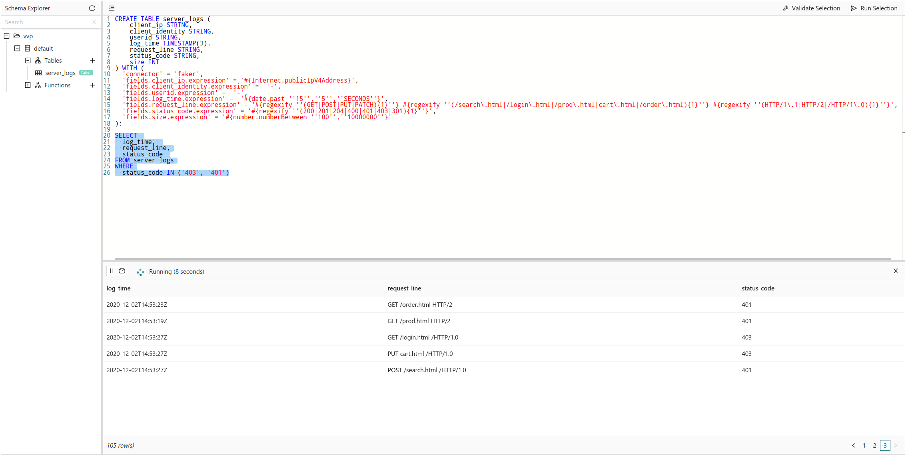

# 02 Filtering Data

## Script

```sql
-- This example will show how to filter server logs 
-- in real-time using a standard WHERE clause.
-- The table it uses is backed by the `faker` connector 
-- (https://github.com/knaufk/flink-faker) which 
-- generates rows in memory and is convenient for testing
-- queries. As such, it is an alternative to the built-in 
-- `datagen` connector for testing or prototyping queries.
CREATE TABLE server_logs ( 
    client_ip STRING,
    client_identity STRING, 
    userid STRING, 
    log_time TIMESTAMP(3),
    request_line STRING, 
    status_code STRING, 
    size INT
) WITH (
  'connector' = 'faker', 
  'fields.client_ip.expression' = '#{Internet.publicIpV4Address}',
  'fields.client_identity.expression' =  '-',
  'fields.userid.expression' =  '-',
  'fields.log_time.expression' =  '#{date.past ''15'',''5'',''SECONDS''}',
  'fields.request_line.expression' = '#{regexify ''(GET|POST|PUT|PATCH){1}''} #{regexify ''(/search\.html|/login\.html|/prod\.html|cart\.html|/order\.html){1}''} #{regexify ''(HTTP/1\.1|HTTP/2|/HTTP/1\.0){1}''}',
  'fields.status_code.expression' = '#{regexify ''(200|201|204|400|401|403|301){1}''}',
  'fields.size.expression' = '#{number.numberBetween ''100'',''10000000''}'
);
-- You can filter this (unbounded) table of 
-- requests for those that experience authx issues
-- by running a simple SELECT statement with a 
-- WHERE clause. In Ververica Platform you 
-- will see the results printed to the UI in the 
-- query preview.
SELECT 
  log_time, 
  request_line,
  status_code 
FROM server_logs
WHERE
  status_code IN ('403', '401')
```

## Example Output


